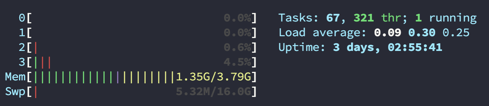
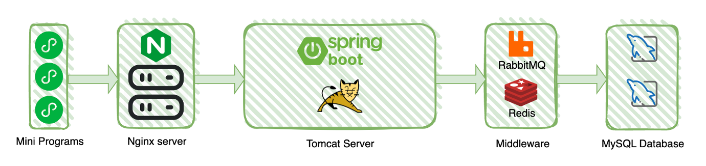

# Tiedyer-Backend


## System Requirements

To ensure the normal operation of the Tiedyer application backend, it is recommended to use a server with a minimum configuration of `2 cores and 2GB` of RAM.

> The following image displays the performance usage of the server (4 cores, 4GB RAM) when **no incoming requests are being processed**:




## Architecture



This project adopts a front-end and back-end separation architecture, allowing the application's front-end (user interface and interactive logic) and back-end (data processing and business logic) to be developed and deployed separately. This architecture enables independent development, high flexibility, parallel development, and enhances performance and user experience.

When a user clicks on the WeChat mini-program interface, an HTTP request is sent to the corresponding Nginx server. If the requested resource is a static file (such as images or binary files for 3D models), Nginx can directly serve these static resources to the user, improving access speed and efficiency. For dynamic requests or data requiring back-end processing, Nginx acts as a reverse proxy and forwards the request to the back-end Tomcat server.

On the Tomcat server, the request is routed to the respective handler, which might involve processes such as retrieving, updating, or manipulating data from the database. Once the back-end completes data processing, it generates the corresponding data and sends it back to the front-end. Upon receiving the response data from the server, the front-end processes and renders the received data accordingly, ultimately presenting the required page or effects to the user.


## Implementation Functions

1. User Module

   One-click WeChat login, synchronization of personal information with WeChat, earning and redeeming points, and managing shipping addresses.

2. Q&A Gaming Module

   Randomly fetches daily questions and evaluates user answers.

3. Badge Module

   Redeeming and viewing badges.

4. Product Module

   Various product search functionalities including popular recommendations, category-based searches, keyword searches, viewing product details, and adding items to the shopping cart.

5. Order and Payment Module

   Creating orders and making payments, viewing different types of orders such as unpaid orders and pending orders.


## Technical Highlights

1. **Security**: We use two tokens – refreshToken stored securely in Redis and accessToken generated by JWT for authorization. This setup ensures security by limiting access to user information through accessToken and managing token refreshes separately. Tools like Spring Security bolster efficient permission management, safeguarding user data.
2. **Product Management**: We organize our database using SKU (Stock Keeping Unit) and SPU (Standard Product Unit) concepts, simplifying the categorization and sale of products with various specifications. This approach streamlines inventory management and simplifies product data maintenance.
3. **Order Processing**: RabbitMQ, coupled with specific plugins, serves as a delayed queue solution. It automatically cancels unpaid orders if users fail to complete payments within 15 minutes, ensuring efficient order handling.
4. **Deployment with Docker**: We leverage Docker for swift and scalable deployment, enabling quick application deployment and scalability through containerization.


## Deployment Tutorial

> The following deployment tutorial is only applicable for the "Ubuntu" system.

The essential components required to run the project are:

- Nginx - 1.18.0
- MySQL - 8.0.32
- Redis - 6.2.6
- RabbitMQ - 3.12-management (requires the [rabbitmq_delayed_message_exchange](https://github.com/rabbitmq/rabbitmq-delayed-message-exchange) plugin)


You can choose to manually install the required components mentioned above. After that, use an IDE to open the source code, modify the corresponding contents in the `application.yml` and `application.prod.yml` files (the parts marked with TODO). Then, use the `gradlew` command to package the application and proceed with the deployment. However, we cannot guarantee successful execution.

We've provided a script for quick deployment to facilitate the rapid startup of the project. Executing this script requires the following prerequisites:

1. Ubuntu operating system.
2. Ensuring that non-negotiable ports are not occupied: `5672`, `15672`, `80`, `443`.


First, you need to move this project to the server. You can either clone it from **GitHub** or directly transfer it to the server using **SFTP**.

```sh
git clone https://github.com/Garden-baby-warrior/Tiedyer-Backend.git
```

Then, navigate to the `./Tiedyer-Backend/deploy` directory and use the `vim` command to modify the `.env` file.

```sh
cd ./Tiedyer-Backend/deploy 
vim .env
```

The content of `.env` file is as follows:

> Changing the `REDIS_PASSWORD` will modify the `requirepass` field in the `redis.conf` file.

```sh
#------------- SpringBoot -------------
# Service port number
EXPOSE_PORT=7576
# JWT secret => Jwts.SIG.HS256.key().build();
JWT_SECRET=TngFesjwnuqQ+ysZj8n6GGJEpf7k/wGzYS4zRPpUrJc=
# WeChat mini program: appId (Must be replaced)
APP_ID=--secret--
# WeChat mini program: appSecret (Must be replaced)
APP_SECRET=--secret--

#------------- MySQL -------------
# port
MYSQL_PORT=3306
# root password
MYSQL_ROOT_PASSWORD=4QgR2etwEvnv
# new database
MYSQL_DATABASE=tiedyer

#------------- Redis -------------
# port
REDIS_PORT=6379
# password
REDIS_PASSWORD=123456

#------------- RabbitMQ -------------
# username
RABBITMQ_DEFAULT_USER=tiedyer
# password
RABBITMQ_DEFAULT_PASS=XdE7.epvGWiRrUYAQFw

#------------- ProjectLocation -------------
# Automatically replace when executing tiedyer.sh
PROJECT_LOCATION=/home
```

Next, you just need to run the `tiedyer.sh` file!!!

```sh
sh ./tiedyer.sh
```


When you see the following outcome, it indicates a successful build.

```sh
 _______ _          _
|__   __(_)        | |
   | |   _  ___  __| |_   _  ___ _ __
   | |  | |/ _ \/ _` | | | |/ _ \ '__|
   | |  | |  __/ (_| | |_| |  __/ |
   |_|  |_|\___|\__,_|\__, |\___|_|
                       __/ |
                      |___/
Program is starting...
----------------------------------------
Checking Docker Engine...
Docker version 24.0.7, build afdd53b
Docker Engine is already installed!
----------------------------------------
Checking Docker Compose...
Docker Compose version v2.21.0
Docker Compose is already installed!
----------------------------------------
Parent directory is /home
----------------------------------------
Start creating directories....
Created /home/mysql/data directory
Created /home/mysql/conf directory
Created /home/mysql/init directory
Created /home/nginx/html directory
Created /home/redis/data directory
Created /home/tiedyer/resource directory
Creating directories completed!
----------------------------------------
Start copying files...
my.cnf copied to /home/mysql/conf/
init.sql copied to /home/mysql/init/
redis.conf copied to /home/redis/
nginx.conf copied to /home/nginx/
Files copying completed!
----------------------------------------
Start building Docker Images
................................
Building Docker Images completed!
----------------------------------------
Starting services
[+] Running 6/6
 ✔ Network deploy_tiedyer_net  Created                                          0.2s 
 ✔ Container nginx             Started                                          1.2s 
 ✔ Container redis             Started                                          1.2s 
 ✔ Container rabbitmq          Started                                          1.3s 
 ✔ Container mysql             Started                                          1.1s 
 ✔ Container tiedyer-backend   Started                                          0.1s 
Service started successfully!
```


## API Documentation

Please refer to the [API documentation](./APIdoc.md) for details.
