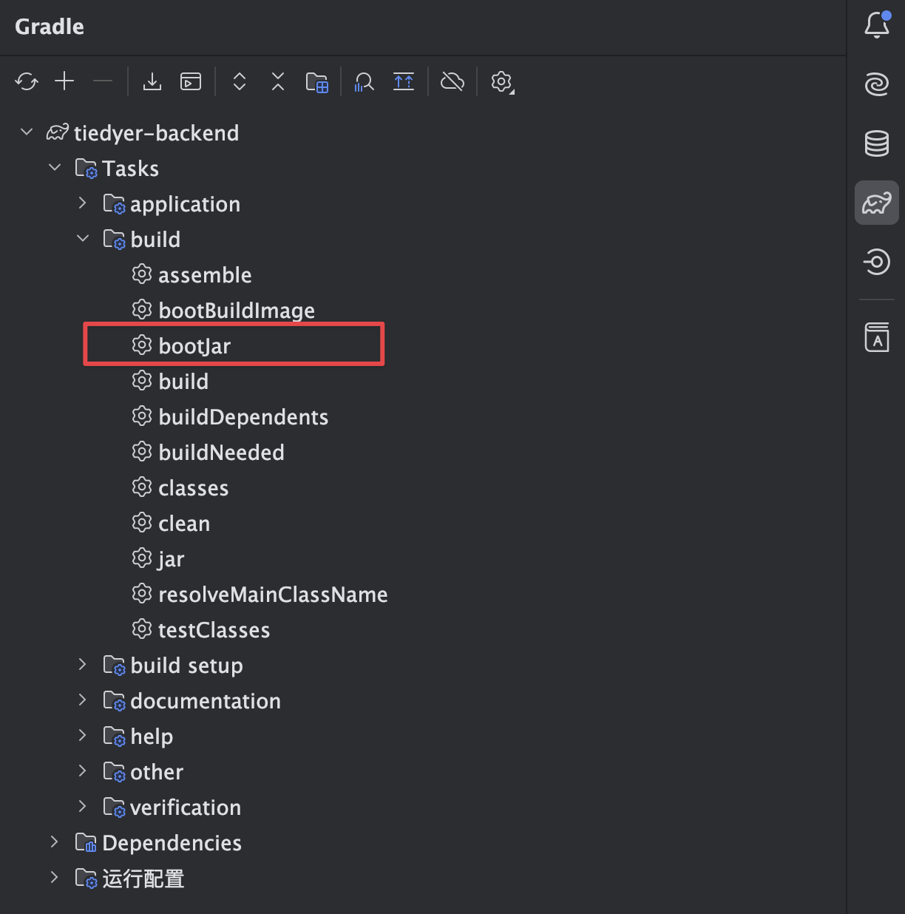
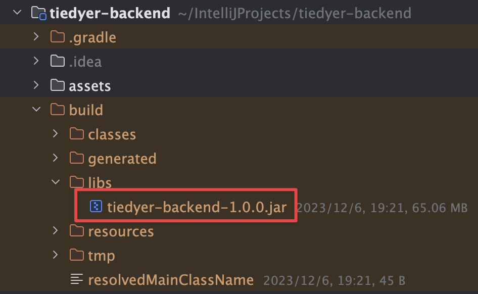

# Tiedyer-Backend

## Deployment Tutorial

The following deployment tutorial is for `Ubuntu` systems and provides the following deployment options:

1. Using `Docker` to package the project into an image for deployment (excluding the necessary components for the project to run) — Not recommended.
2. **Using `Docker` + `Docker Compose V2` for a one-click deployment of the project (including the necessary components for the project to run) — Recommended.**

While you could choose to directly run the packaged `JAR` file, this method requires you to manually ensure that `openJDK17` is installed on your server and configured correctly. However, we don't recommend this approach due to the complexity and potential for error in maintaining and managing the compatibility and proper configuration of the required components.

Similarly, we also do not recommend deploying the project directly using `Docker` because we cannot guarantee that the project will run successfully in your current server environment. Therefore, **we strongly advise using `Docker` + `Docker Compose V2` for a one-click deployment of the project.**

The following are the components required to run the project:

> If you choose method 1 (using `Docker` to package the project into an image for deployment) or directly running the `JAR` file, you'll need to install and configure the following components yourself:

- Nginx - 1.18.0
- MySQL - 8.0.32
- Redis - 6.2.6
- RabbitMQ - 3-management

### Install Docker

**Install Docker Engine**

> https://docs.docker.com/engine/install/ubuntu/#install-using-the-convenience-script

```sh
curl -sSL https://get.docker.com/ | sh
```

**Install the Compose plugin V2**

> https://docs.docker.com/compose/install/linux/#install-using-the-repository

```sh
sudo apt-get update
sudo apt-get install docker-compose-plugin
```

### Packaging the Project into a JAR File

1. Open the project using an **IDE (IDEA/Eclipse)**.

2. Modify the `application-prod.yml` and `application.yml` file located in the `src/main/resources` directory.

   > You only need to modify configurations marked with `TODO` in the file.

   `application.yml`

   ```yaml
   my-token:
     token-name: Authorization #The token name, including the redis prefix, the name of the attribute read in the request header, and the default Authorization.
     refresh-token:
       exp: 5184000    # RefreshToken expiration time in seconds, default 5184000 seconds (60 days).
     jwt:
       secret: **secret** # TODO JWT signature key, you need to generate it yourself.=>Jwts.SIG.HS256.key().build();
       exp: 7200     # JWT expiration time (seconds), default 7200 seconds (2 days)
   
   
   api:
     # WeChat Login API
     # You need to apply for the WeChat One-Click Login API, otherwise you will not be able to use the WeChat One-Click Login function
     wx:
       appId: **secret**     # TODO Enter appId
       secret: **secret**    # TODO Enter secret
       grantType: authorization_code
   ```

   `application-prod.yml`

   ```yaml
   spring:
     data:
       # redis configuration
       redis:
         database: 0           # Redis Database Indexing
         host: redis       #TODO Replace it with the IP address of your Redis, under the same docker network, and just fill in the container name
         port: 6379
         password:   #TODO Replace with your Redis password
     # rabbitMQ configuration
     rabbitmq:
       host: rabbitmq          #TODO IP address of RabbitMQ, under the same docker network, just fill in the container name
       port: 5672
       username: tiedyer
       password: **secret**      #TODO RabbitMQ corresponding user password
       virtual-host: /
     # Database Configuration
     datasource:
       url: jdbc:mysql://mysql:3306/tiedyer?useUnicode=true&characterEncoding=UTF-8&serverTimeZone=Asia/Shanghai #TODO Replace it with your database IP address, under the same docker network, and just fill in the container name
       username: root
       password: **secret**		#TODO MySQL corresponding user password
   ```

3. Packaging project with `Gradle`

   
   
   The packaged JAR file is stored at the following location：
   
   


